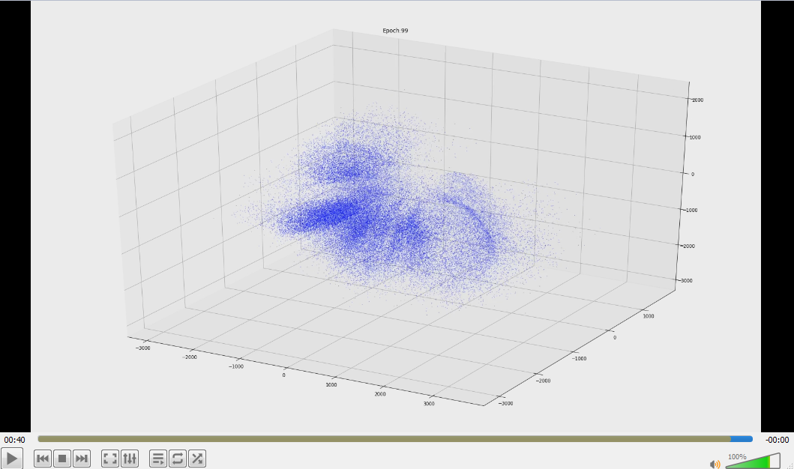

# An-Autoencoder-Playground
An Autoencoder's embedding dynamics visualization and hyper-parameters experiment, for example, for clustering analysis.
The code is obtained from [deep embedded clustering](https://github.com/XifengGuo/DEC-keras) and modified for the experiments, the results of which are yet to be obtained.

